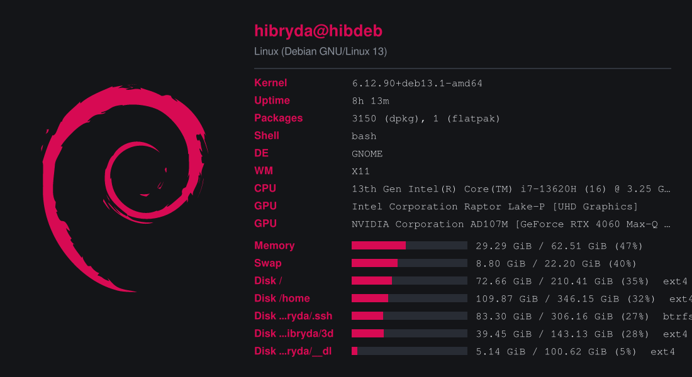
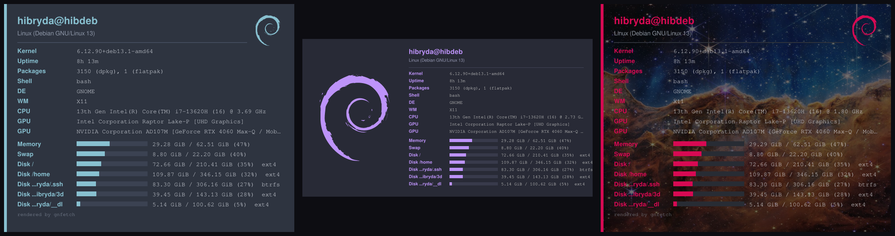
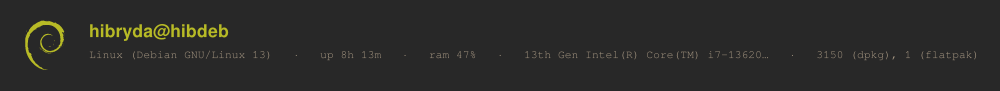

<div align="center">

# gnfetch

**A neofetch/fastfetch alternative in Rust that renders your system info as a rich, graphical "visiting card" — not just ASCII.**

[](LICENSE)
[](https://www.rust-lang.org)
[](#installation)



</div>

gnfetch detects your OS, kernel, CPU, GPU, memory, disk, uptime, packages, shell, and
desktop/WM, then renders it two ways:

- **Classic ANSI** — the familiar neofetch experience: an ASCII logo and an aligned
  key/value block, in truecolor.
- **A graphical "system visiting card"** — composited as a real image and shown *inline*
  in terminals that support it (Kitty graphics protocol, iTerm2 inline images, or Sixel),
  with automatic capability detection and a clean fallback to ANSI when none are available.

It also exports the card to a PNG (`--save`), so you can use it anywhere.

## Showcase

<div align="center">

<br><em>Aesthetic themes (Nord, Dracula) and an image background — all from the same machine.</em>
<br><br>

<br><em>The <code>strip</code> layout — a compact status band.</em>
</div>

> Run `gnfetch --demo` for a captioned gallery of every layout, theme, logo, and background
> across a dozen example distros.

## Features

- **5 layouts** — `card` (default), `neofetch` (logo + info), `columns`, `strip`, `compact`.
- **Themes everywhere** — `auto` matches your distro's brand colours (Debian red, Ubuntu
  orange, …) over clean near-black neutrals; plus 8 aesthetic presets (Nord, Dracula,
  Gruvbox, Catppuccin, Tokyo Night, Solarized, Rosé Pine) and 21 distro palettes. `--light`
  for a light variant, `--accent '#rrggbb'` to override, `--brand` to keep the distro colour
  with another theme. Applies to **both** the card and the ANSI output.
- **Logos** — `drawn` (47 recoloured [Simple Icons](https://simpleicons.org) SVGs + a
  generic Tux fallback), `ascii` (262 neofetch arts), `image` (your own), or `off`.
- **Backgrounds** — `solid`, `gradient`/`diagonal`/`radial`/`grid`/`dots`, `linear-<angle>`
  for any-angle gradients, or an **image** from a file, an `https://` URL, or a bundled
  CC0 image (`andromeda`, `aurora`, `carina`, `earth`, `helix` — NASA public domain).
  `--background-fit fill|fit|stretch|center`. Gradients are dithered (no 8-bit banding).
- **Fonts** — a two-slot system (heading + body): your system fonts by default, or pick any
  installed family or a bundled font (`--sans`/`--serif`/`--mono`).
- **Configurable fields** — choose which info lines show and their order.
- **One-shot, fast, no daemon** — like neofetch. Config via `~/.config/gnfetch/config.toml`,
  overridden by CLI flags.

## Installation

> Prebuilt artifacts (Linux x86_64 and aarch64) are attached to each
> [release](https://github.com/Hibryda/gnfetch/releases). Pick the method for your distro.

### Debian / Ubuntu (`.deb`)

```bash
curl -LO https://github.com/Hibryda/gnfetch/releases/latest/download/gnfetch_amd64.deb
sudo dpkg -i gnfetch_amd64.deb
```

### Fedora / openSUSE (`.rpm`)

```bash
sudo rpm -i https://github.com/Hibryda/gnfetch/releases/latest/download/gnfetch.x86_64.rpm
```

### Arch Linux (AUR)

```bash
yay -S gnfetch        # builds from source
yay -S gnfetch-bin    # or the prebuilt binary (no compile)
```

### AppImage (any distro)

```bash
curl -LO https://github.com/Hibryda/gnfetch/releases/latest/download/gnfetch-x86_64.AppImage
chmod +x gnfetch-x86_64.AppImage
./gnfetch-x86_64.AppImage
```

### Prebuilt binary (tarball)

```bash
curl -L https://github.com/Hibryda/gnfetch/releases/latest/download/gnfetch-x86_64-unknown-linux-musl.tar.gz | tar xz
sudo install gnfetch /usr/local/bin/
```

### From source (Cargo)

Requires a Rust toolchain (**1.95+**, via [rustup](https://rustup.rs)):

```bash
cargo install --git https://github.com/Hibryda/gnfetch
# or, from a checkout:
git clone https://github.com/Hibryda/gnfetch && cd gnfetch
cargo install --path .
```

## Usage

```bash
gnfetch                      # auto-detect the terminal and render
gnfetch --mode ansi          # force classic ASCII/ANSI output
gnfetch --mode image         # force the graphical card
gnfetch --save card.png      # export the card to a PNG (works anywhere)
gnfetch --demo               # a tour of every option
gnfetch --help               # all flags
```

A few looks:

```bash
gnfetch --layout neofetch --theme nord
gnfetch --layout strip --theme dracula
gnfetch --background linear-30 --accent '#ff8800'
gnfetch --background-image carina                 # a bundled CC0 image
gnfetch --background-image ~/wallpaper.png --background-fit fit
gnfetch --fields cpu,gpu,memory,disk              # pick the lines you want
```

The graphical card works in Kitty, WezTerm, iTerm2, Konsole, foot, and other terminals with
inline-graphics support; elsewhere it falls back to ANSI. `--save` needs no special terminal.

## Configuration

All options can be set in `~/.config/gnfetch/config.toml` and overridden by flags. See
**[`docs/configuration.md`](docs/configuration.md)** for the full reference, and the
[**wiki**](https://github.com/Hibryda/gnfetch/wiki) for guides and examples.

`--list-themes`, `--list-layouts`, `--list-fields`, `--list-fonts`, and `--list-backgrounds`
print the available values.

## How it works

A clean one-way pipeline keeps collection and rendering independent:

```
Collectors → SystemInfo → Renderer → stdout
```

- **Collectors** (`src/collectors/`) — one module per domain, each degrading gracefully to
  `None`/empty instead of panicking. Built on `sysinfo`, supplemented by `/proc`, `/sys`,
  and `/etc/os-release` reads on Linux.
- **Model** (`src/model.rs`) — a single `SystemInfo` aggregate, the contract between the two.
- **Renderers** (`src/render/`) — an ANSI renderer and a graphical one that composites the
  card with `image`/`imageproc`/`ab_glyph`/`resvg` and emits it via `viuer`. A capability
  probe selects the renderer, always with ANSI as the safe fallback.

## Building & contributing

```bash
cargo build --release
cargo test
cargo clippy --all-targets -- -D warnings
cargo fmt --check
```

Some modules are generated from assets (`scripts/gen_*.py` produce the embedded ASCII/SVG
logo tables and bundled-image index). Contributions welcome — please run fmt, clippy, and
tests before opening a PR.

## Credits & License

gnfetch is licensed under the [MIT License](LICENSE).

Bundled assets keep their own licenses:

- Distro logos — [Simple Icons](https://github.com/simple-icons/simple-icons) (CC0).
- ASCII art — [neofetch](https://github.com/dylanaraps/neofetch) (MIT).
- Background images — NASA public-domain imagery ([`assets/backgrounds/LICENSE.txt`](assets/backgrounds/LICENSE.txt)).
- Fonts — DejaVu (Bitstream Vera derived) and bundled OFL/Apache families
  ([`assets/fonts/`](assets/fonts/)).
